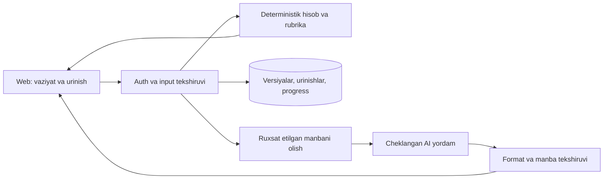

# Finora texnik topshirig‘i

## Maqsad va doira

MVP kattalarga o‘zbek tilida uch ko‘nikmani mashq qildiradi: budjet cheklovini tushunish, favqulodda zaxirani rejalash va kredit taklifining umumiy xarajatini taqqoslash. Natija foydalanuvchining mustaqil yechgan yangi masalasi bilan o‘lchanadi. “Moliyaviy muvaffaqiyat kafolati” yoki “rasmiy CP3P sertifikati” mahsulot va’dasiga kirmaydi.

Birinchi pilot: 10 ekspert tekshirgan ssenariy, uch interaksiya turi, bitta til, moslashuvchan web interfeys. Mavjud kurs, navigatsiya va manba ko‘rish imkoniyati saqlanadi. PPP alohida yo‘nalish; uning to‘liq yangilanishi [roadmap](roadmap.md)dagi kirish mezoniga bog‘liq.

MVPga bank hisobini ulash, real savdo, individual investitsiya tavsiyasi, native ilova, jonli video avatar, ochiq kurs marketplace va bolalar hisoblari kirmaydi. Ushbu chegaralar kichik jamoaga hisob, pedagogika va qulaylikni tekshirishga imkon beradi.

## Foydalanuvchi oqimlari

**Yangi tashrif.** Bosh sahifa bitta aniq natijani ko‘rsatadi. “Mashqni sinash” foydalanuvchini ro‘yxatdan o‘tmasdan demo vaziyatga olib boradi. Birinchi mustaqil urinishdan so‘ng natijani saqlash taklif qilinadi; rad etsa demo ishlashda davom etadi. Mehmon uchun cheksiz pullik AI ochilmaydi: tayyor hint yoki cheklangan server nazoratli demo ishlatiladi.

**Ro‘yxatdan o‘tgan o‘quvchi.** Maqsadni tanlaydi, 3–5 diagnostik savolga javob beradi; shaxsiy daromadini oshkor qilish shart emas. Dashboard bir asosiy keyingi amalni, qayta mashqni va o‘zlashtirilayotgan ko‘nikmani ko‘rsatadi. “Dars ko‘rildi”, “mashq bajarildi” va “mustaqil o‘zlashtirildi” alohida holatlar bo‘ladi.

**Mashq.** Vaziyat va shartlar ko‘rinadi, tanlov yoki son kiritiladi. Server urinishni tekshiradi, hisob moduli oqibatni chiqaradi. AI birinchi urinishdan keyin xatoga mos yordam beradi. Foydalanuvchi manbani ochishi, orqaga qaytishi va boshqa variantni sinashi mumkin. Oqibat faqat rang yoki animatsiya bilan ifodalanmaydi.

**Yordam.** Birinchi hint muhim shartga e’tibor qaratadi; ikkinchisi qadamni taklif qiladi; uchinchisi ishlangan misolni ochadi. Ishlangan javobni ko‘rish taqiqlanmaydi, ammo bu urinish mustaqil mastery hisoblanmaydi. Keyingi variantda yordam holati qayta boshlanadi.

**Uzilish.** Tarmoq yoki AI ishlamasa foydalanuvchi kiritgan javob yo‘qolmaydi. “Qayta yuborish” bir urinishni ikki marta hisoblamaydi. AI bo‘lmaganda hisob, manba va ekspert yozgan izoh ishlaydi. Saqlanmagan holat muvaffaqiyat deb ko‘rsatilmaydi.

## Dastlabki kontent

| ID | Ssenariy | Tekshiriladigan ko‘nikma |
|---|---|---|
| B01 | Oylik tushdi: majburiy va ixtiyoriy xarajat | Cheklangan mablag‘ni taqsimlash |
| B02 | Daromad bir oyga kamaydi | Rejani yangi shartga moslashtirish |
| B03 | Kichik obunalar yig‘indisi | Takrorlanuvchi xarajatlarni hisoblash |
| B04 | Rejalangan xarid va kutilmagan to‘lov | Ustuvorlik sababini tushuntirish |
| R01 | Ta’mir uchun zaxira yetadimi? | Likvid zaxira va maqsadni farqlash |
| R02 | Har oy qo‘shib borish | Vaqt, badal va stavka birligini tushunish |
| R03 | Maqsad muddati o‘zgardi | Kerakli badalni qayta hisoblash |
| K01 | Past stavka, lekin komissiya bor | Jami to‘lovni solishtirish |
| K02 | Uzoq muddat va kichik oylik to‘lov | Oylik yuk bilan jami xarajat farqi |
| K03 | Yangi shartli kredit taklifi | Oldingi bilimni yordamsiz qo‘llash |

Har ssenariy kamida uch validatsiya qilingan parametr variantiga ega bo‘ladi. Sonlarni tasodifiy almashtirish masalani yaroqsiz qilmasligi uchun cheklovlar tekshiriladi. Mahalliy mahsulot shartlari misol bo‘lsa, manba va amal sanasi ko‘rsatiladi; shartli raqamlar “o‘quv misoli” deb belgilanadi.

Kontent tuzilmasi: o‘quv maqsadi, oldingi bilim, vaziyat, parametr chegarasi, javob/rubrika, keng tarqalgan xato, uch hint, mustaqil variant, manba, huquq, ekspert, versiya va qayta ko‘rish sanasi. Nashr jarayoni `draft → subject review → language review → tested → published → superseded`. Nashr qilingan versiya eski urinishlarning ma’nosini o‘zgartirib yubormaydi.

## Funksional talablar va qabul mezonlari

| ID | Talab | Qabul qilish dalili |
|---|---|---|
| FR01 | Hisobsiz demo va saqlash taklifi | Yangi sessiyada demo tugaydi; login rad etilganda majburiy redirect yo‘q |
| FR02 | Diagnostika va keyingi qadam | Belgilangan javoblar to‘plami kutilgan ko‘nikma yo‘liga olib boradi; barcha kurslar tugaganda ham to‘g‘ri holat |
| FR03 | Uch interaksiya turi | Klaviatura, touch va son kiritish bilan bir xil natija; faqat sudrashga bog‘liqlik yo‘q |
| FR04 | Server baholaydigan urinish | Client yuborgan `isCorrect`, ball yoki completion qiymati e’tiborga olinmaydi |
| FR05 | Hint bosqichlari | Hint darajasi qayd etiladi; to‘liq javob ochilgan urinish mustaqil deb belgilanmaydi |
| FR06 | Mustaqil variant | AI va javob kaliti yuborilmaydi; boshqa parametrli masala serverda baholanadi |
| FR07 | Saqlash va davom ettirish | Sahifa yangilangach versiya, javob va keyingi amal tiklanadi; dublikat ball yo‘q |
| FR08 | Takrorlash navbati | Dastlabki jadval, kechikkan mashq, vaqt zonasi va o‘chirish holatlari testdan o‘tadi |
| FR09 | Manbaga bog‘liq izoh | Har havola server tanigan source ID va sahifaga yechiladi; noma’lum ID chiqarilmaydi |
| FR10 | Kontent boshqaruvi | Ekspert ko‘rmagan yoki huquqi noma’lum materialni nashr qilib bo‘lmaydi |
| FR11 | Hisobni boshqarish | Ma’lumot eksporti/o‘chirish talabi, holat va tugash xabari stagingda tekshiriladi |
| FR12 | PPP versiya ko‘rsatishi | Nashr/til/yo‘nalish ko‘rinadi; eski nashr amaldagi sertifikatsiya kafolati sifatida ko‘rsatilmaydi |

## Texnik tuzilma

Mavjud Next.js va Supabase asosini saqlash tavsiya etiladi; qayta yozish uchun o‘lchangan sabab yo‘q. Next API va konvensiyalari o‘rnatilgan versiyaning `node_modules/next/dist/docs/` hujjatlari bo‘yicha tekshiriladi. UI son kiritish va natijani ko‘rsatadi; server avtorizatsiya, baholash va kontent versiyasini nazorat qiladi.

Pul hisoblari alohida sof modulga chiqariladi. Stavka nominalmi yoki samaralimi, kapitalizatsiya davri va badal oyning boshidami/oxiridami UI hamda funksiyada aniq belgilanadi. Nol stavka, nol badal, maqsadga allaqachon yetish, noto‘g‘ri muddat va katta sonlar tekshiriladi. Ichki hisobda muddatidan oldin yaxlitlash yo‘q; ko‘rsatish aniqligi va yakuniy to‘lov qoidasi hujjatlashtiriladi. Kredit misolida komissiya/soliq/sug‘urta kiritilmagan bo‘lsa shu taxmin natija yonida ko‘rinadi.

Ma’lumot modeli hozir konseptual, migratsiya emas:

| Obyekt | Muhim maydon va qoida |
|---|---|
| ContentVersion | Barqaror ID, kurs/ko‘nikma, edition, til, holat, reviewer, publishedAt; published versiya o‘zgarmaydi |
| Source / SourceChunk | Fayl xeshi, huquq, publisher, sana, sahifa oralig‘i, ishonch holati; xususiy fayl ommaviy bo‘lmaydi |
| ScenarioVersion | Parametrlar, tekshirish algoritmi, answer/rubric serverda, bog‘langan kontent versiyasi |
| Attempt | user, scenarioVersion, variant, answer, server result, hintLevel, timestamps, idempotencyKey |
| SkillMastery | Mustaqil va yordamli natija alohida; qaysi urinishlar asos bo‘lganini kuzatish mumkin |
| ReviewItem | skill, dueAt, holat; foydalanuvchi vaqt zonasi bilan namoyish qilinadi |
| Consent / PrivacyRequest | Maqsad, policyVersion, vaqt, qaytarib olish yoki o‘chirish holati |
| TutorUsage | Model/version, token/cost, latency, outcome; xom shaxsiy matn standart analitikaga yozilmaydi |

Mavjud `users`, `lesson_progress`, `chat_sessions`, `chat_messages` bilan migratsiya xaritasi alohida yoziladi. Eski “completed” holati avtomatik ravishda “mastered”ga aylanmaydi. RLS foydalanuvchi/rol chegaralarini himoya qiladi; service key clientga chiqmaydi. Supabase hujjatlari RLSni bazadagi himoya sifatida ko‘rsatadi, lekin siyosat borligi uning barcha holatlarda to‘g‘riligini isbotlamaydi.[^1]

Tavsiya etiladigan API shartnomalari: `POST /api/attempts` — scenarioVersion, variantId, answer, idempotencyKey; `POST /api/tutor` — serverga tegishli sessionId, attemptId, message; `GET /api/reviews` — faqat joriy foydalanuvchi navbati. Birinchi yuborish 201, takroriy bir xil idempotent yuborish mavjud natijani qaytaradi. Noto‘g‘ri format 400, login yo‘q 401, huquq yo‘q 403 yoki resursni yashirish siyosatiga mos 404, eskirgan versiya 409, limit 429, vaqtinchalik provider xatosi 503. Tavsiya etilgan endpointlar hali yozilmagan.

## AI talablari

Hozirgi Anthropic integratsiyasini sabab bo‘lmasdan almashtirish shart emas. Kamida ikki mos konfiguratsiya bir xil o‘zbekcha eval to‘plamida aniqlik, pedagogika, kechikish va xarajat bo‘yicha solishtiriladi. Aniq model nomi va narxi qaror kuni rasmiy manbadan tekshiriladi.

Server lesson/attempt ID orqali tasdiqlangan vaziyat va manba bo‘laklarini oladi. Client yuborgan “kontekst” system vakolatiga ega emas. PDFdagi va foydalanuvchi matnidagi buyruqlar ma’lumot sifatida ko‘riladi. Model hisobni o‘zi uydirmaydi: deterministik natijani tushuntiradi. Javob strukturasi `hintLevel`, `explanation`, `sourceIds`, `needsExpertReview`; noma’lum manba yoki yaroqsiz format foydalanuvchiga haqiqiy havola sifatida chiqmaydi.

Qidiruv topa olmagan savolga “manbada aniqlanmadi” holati bor. AI javobi yakuniy moliyaviy maslahat yoki tasdiqlangan baho vazifasini bajarmaydi. Shaxsiy karta, parol va hisob ma’lumotini so‘ramaydi; foydalanuvchi tasodifan kiritsa loglarga tarqalishini cheklash kerak.

Pilot uchun boshlang‘ich limit taklifi: bitta xabar 4 000 belgi, umumiy request 32 KB, oxirgi 12 xabar, 800 output token, bir userga 5 so‘rov/minut va 40/kun. Bu qiymatlar tekshirilgan optimal ko‘rsatkich emas; yuk va pedagogik testdan keyin sozlanadi. Limitlar serverda tekshiriladi, uzilgan oqim bekor qilinadi, xatoda avtomatik cheksiz qayta urinish bo‘lmaydi. Kunlik xarajat chegarasi oshsa tayyor izoh rejimiga o‘tiladi.

Eval korpusi dastlab 120 ekspert belgilagan holatdan iborat bo‘ladi: 30 hisob/izoh, 30 pedagogik yordam, 20 manba/eskirgan nashr, 20 injection/maxfiylik va 20 o‘zbekcha tushunarlilik holati. Sonlar reja, hali mavjud dataset emas. AI o‘zgarishi oldidan bir xil holdout ishlatiladi, eng muhim holatlar uch marta bajariladi. Vazifaga xos va uzluksiz eval zarurligi rasmiy AI qo‘llanmasiga mos; runner va dataset providerga bog‘lanmaydi.[^2]

## Sifat talablari

| ID | Maqsad | Qanday tekshiriladi |
|---|---|---|
| NFR01 | WCAG 2.2 AAga mos asosiy oqimlar | Avtomatik skan + klaviatura/screen reader qo‘lda; kontrast, fokus, xato, zoom va target tekshiruvi |
| NFR02 | Telefon ekranida tushunarlilik | 320 CSS pxda asosiy oqim gorizontal scrollsiz; 200% zoom; 44 px ichki touch maqsadi |
| NFR03 | Real foydalanuvchi tezligi | p75 LCP ≤2.5 s, INP ≤200 ms, CLS ≤0.1; yetarli field ma’lumotigacha lab natijasi alohida |
| NFR04 | AI kutish holati | Darhol loading/bekor qilish; pilot maqsadi p95 birinchi foydali javob ≤8 s, provider benchmark bilan |
| NFR05 | Hisob va avtorizatsiya | Belgilangan deterministik testlarda xato yo‘q; staging RLS va API izolyatsiya testlari o‘tadi |
| NFR06 | Kuzatuv va tiklash | Request ID, maxfiylikka mos error log; staging backupdan tiklash protokoli |
| NFR07 | Nashr nazorati | CI tekshiruvlarisiz prod yo‘q; oldingi buildga qaytish va kontent versiyasini muzlatish sinovi |

WCAG 2.2 standartidagi target talabi va istisnolarini ichki 44 px dizayn qoidasiga aralashtirmaslik kerak.[^3] Core Web Vitals qiymatlari real tashriflar p75 mezonidir; lokal buildning o‘tishi bu natijani tasdiqlamaydi.[^4] Xavfsizlik tekshiruvi OWASP ASVS 5.0dan tanlangan, loyiha uchun tegishli talablarni testlarga bog‘laydi; “OWASP certified” degan yorliq qo‘yilmaydi.[^5]

Shaxsiy ma’lumotlar bo‘yicha chiqarishdan oldin ma’lumot turlari, joylashuv, subprocessorlarga uzatish, rozilik, saqlash va o‘chirish muddati hujjatlashtiriladi. O‘zbekiston qonunining amaldagi matni va 2026-yilgi o‘zgarishlar bo‘yicha mahalliy huquqshunos bahosi olinadi. Xorijiy hosting avtomatik taqiqlangan yoki avtomatik mos degan xulosa qilinmaydi.[^6]

## Chiqarish mezoni

Auditdagi P0 bandlar yopilgan, 10 ssenariy ekspert tasdig‘iga ega, FR01–FR12dan pilotga tegishli talablar tekshirilgan, asosiy accessibility to‘siqlari yo‘q va RLS izolyatsiyasi stagingda isbotlangan bo‘lishi kerak. Kritik eval holatlarida kuzatilgan xato qolsa AI funksiyasi cheklanadi. Qolgan nosozliklar egasi va muddati bilan qayd qilinadi. Barcha sinovlarning o‘tishi kelajakda xato bo‘lmaydi degan kafolat emas.

## Manbalar

[^1]: Supabase. [Row Level Security](https://supabase.com/docs/guides/database/postgres/row-level-security), rasmiy hujjat, ko‘rilgan 2026-09-11.
[^2]: OpenAI. [Evaluation best practices](https://developers.openai.com/api/docs/guides/evaluation-best-practices), ko‘rilgan 2026-09-11. Ushbu tavsiya baholash prinsiplariga tegishli, muayyan Evals APIga bog‘lanish talabi emas.
[^3]: W3C. [Web Content Accessibility Guidelines 2.2](https://www.w3.org/TR/WCAG22/), Recommendation, 2024-12-12 nashri, ko‘rilgan 2026-09-11.
[^4]: Google web.dev. [Web Vitals](https://web.dev/articles/vitals), rasmiy mezonlar, ko‘rilgan 2026-09-11.
[^5]: OWASP. [Application Security Verification Standard](https://github.com/OWASP/ASVS), 5.0 seriyasi, ko‘rilgan 2026-09-11.
[^6]: LexUZ. [Shaxsga doir ma’lumotlar to‘g‘risida](https://lex.uz/docs/-4396419), amaldagi tahrir; Adliya vazirligi. [2026-yilgi o‘zgarishlar izohi](https://advice.adliya.uz/oz/document/4613), 2026-04-02. Ko‘rilgan 2026-09-11; huquqiy moslik hali tekshirilmagan.
